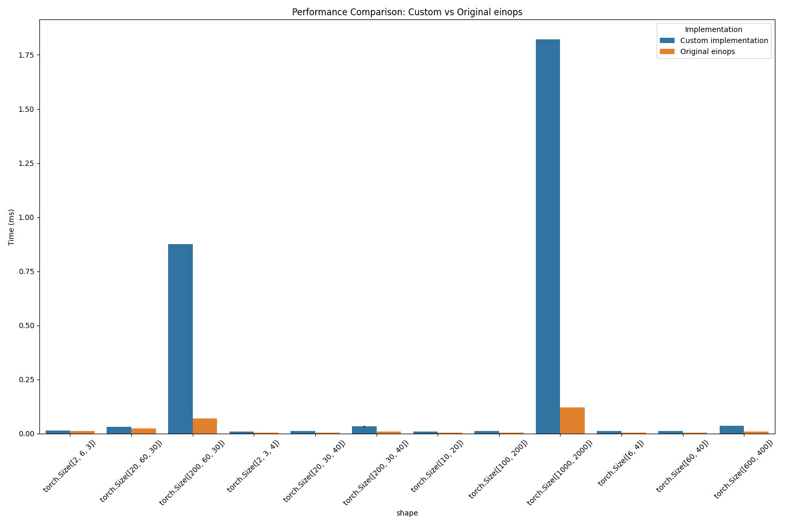

# Performance Comparison: Custom einops vs. Original einops

## Summary
On average, the custom implementation is **2.51x slower** than the original einops library.

## Detailed Performance Results

|    | operation         | shape                     |   Custom implementation |   Original einops |   speedup |   relative_diff_percent |
|---:|:------------------|:--------------------------|------------------------:|------------------:|----------:|------------------------:|
|  0 | Complex pattern   | torch.Size([2, 6, 3])     |                 0.0393  |           0.02791 | 0.710178  |                 40.8097 |
|  1 | Complex pattern   | torch.Size([20, 60, 30])  |                 0.11884 |           0.0878  | 0.738808  |                 35.3531 |
|  2 | Complex pattern   | torch.Size([200, 60, 30]) |                 1.8643  |           0.16444 | 0.0882047 |               1033.73   |
|  3 | Merge dimensions  | torch.Size([2, 3, 4])     |                 0.02126 |           0.00819 | 0.385231  |                159.585  |
|  4 | Merge dimensions  | torch.Size([20, 30, 40])  |                 0.06145 |           0.01439 | 0.234174  |                327.033  |
|  5 | Merge dimensions  | torch.Size([200, 30, 40]) |                 0.08257 |           0.02369 | 0.286908  |                248.544  |
|  6 | Simple reshape    | torch.Size([10, 20])      |                 0.02142 |           0.00992 | 0.463119  |                115.927  |
|  7 | Simple reshape    | torch.Size([100, 200])    |                 0.02251 |           0.01068 | 0.474456  |                110.768  |
|  8 | Simple reshape    | torch.Size([1000, 2000])  |                 3.36383 |           0.24788 | 0.0736898 |               1257.04   |
|  9 | Split dimension   | torch.Size([6, 4])        |                 0.03782 |           0.01293 | 0.341883  |                192.498  |
| 10 | Split dimension   | torch.Size([60, 40])      |                 0.0307  |           0.01358 | 0.442345  |                126.068  |
| 11 | Split dimension   | torch.Size([600, 400])    |                 0.06219 |           0.03303 | 0.531114  |                 88.2834 |
| 12 | Wildcard handling | torch.Size([2, 3, 4])     |                 0.02737 |           0.01433 | 0.523566  |                 90.9978 |
| 13 | Wildcard handling | torch.Size([20, 30, 40])  |                 0.04473 |           0.01655 | 0.369998  |                170.272  |
| 14 | Wildcard handling | torch.Size([200, 30, 40]) |                 0.08526 |           0.02662 | 0.312221  |                220.286  |

## Visual Comparison

## Operation-Specific Analysis

### Simple reshape
For Simple reshape, the custom implementation is on average **12.69x slower**.

### Split dimension
For Split dimension, the custom implementation is on average **2.20x slower**.

### Merge dimensions
For Merge dimensions, the custom implementation is on average **3.57x slower**.

### Wildcard handling
For Wildcard handling, the custom implementation is on average **2.74x slower**.

### Complex pattern
For Complex pattern, the custom implementation is on average **7.22x slower**.

## Scaling Analysis

This section analyzes how performance differences scale with input size.

### Simple reshape
|    | shape                    |   Custom implementation |   Original einops |   speedup |   relative_diff_percent |
|---:|:-------------------------|------------------------:|------------------:|----------:|------------------------:|
|  0 | torch.Size([10, 20])     |                 0.02142 |           0.00992 | 0.463119  |                 115.927 |
|  1 | torch.Size([100, 200])   |                 0.02251 |           0.01068 | 0.474456  |                 110.768 |
|  2 | torch.Size([1000, 2000]) |                 3.36383 |           0.24788 | 0.0736898 |                1257.04  |

As input size increases, the custom implementation gets **relatively slower** (570.56% per step).

### Split dimension
|    | shape                  |   Custom implementation |   Original einops |   speedup |   relative_diff_percent |
|---:|:-----------------------|------------------------:|------------------:|----------:|------------------------:|
|  0 | torch.Size([6, 4])     |                 0.03782 |           0.01293 |  0.341883 |                192.498  |
|  1 | torch.Size([60, 40])   |                 0.0307  |           0.01358 |  0.442345 |                126.068  |
|  2 | torch.Size([600, 400]) |                 0.06219 |           0.03303 |  0.531114 |                 88.2834 |

As input size increases, the custom implementation gets **relatively faster** (52.11% per step).

### Merge dimensions
|    | shape                     |   Custom implementation |   Original einops |   speedup |   relative_diff_percent |
|---:|:--------------------------|------------------------:|------------------:|----------:|------------------------:|
|  0 | torch.Size([2, 3, 4])     |                 0.02126 |           0.00819 |  0.385231 |                 159.585 |
|  1 | torch.Size([20, 30, 40])  |                 0.06145 |           0.01439 |  0.234174 |                 327.033 |
|  2 | torch.Size([200, 30, 40]) |                 0.08257 |           0.02369 |  0.286908 |                 248.544 |

As input size increases, the custom implementation gets **relatively slower** (44.48% per step).

### Wildcard handling
|    | shape                     |   Custom implementation |   Original einops |   speedup |   relative_diff_percent |
|---:|:--------------------------|------------------------:|------------------:|----------:|------------------------:|
|  0 | torch.Size([2, 3, 4])     |                 0.02737 |           0.01433 |  0.523566 |                 90.9978 |
|  1 | torch.Size([20, 30, 40])  |                 0.04473 |           0.01655 |  0.369998 |                170.272  |
|  2 | torch.Size([200, 30, 40]) |                 0.08526 |           0.02662 |  0.312221 |                220.286  |

As input size increases, the custom implementation gets **relatively slower** (64.64% per step).

### Complex pattern
|    | shape                     |   Custom implementation |   Original einops |   speedup |   relative_diff_percent |
|---:|:--------------------------|------------------------:|------------------:|----------:|------------------------:|
|  0 | torch.Size([2, 6, 3])     |                 0.0393  |           0.02791 | 0.710178  |                 40.8097 |
|  1 | torch.Size([20, 60, 30])  |                 0.11884 |           0.0878  | 0.738808  |                 35.3531 |
|  2 | torch.Size([200, 60, 30]) |                 1.8643  |           0.16444 | 0.0882047 |               1033.73   |

As input size increases, the custom implementation gets **relatively slower** (496.46% per step).

## Conclusion

The original einops library generally outperforms the custom implementation. This suggests there may be optimization opportunities in the custom code. 

### Recommendations

Consider optimizing these operations in the custom implementation:
- Complex pattern
- Merge dimensions
- Simple reshape
- Split dimension
- Wildcard handling
